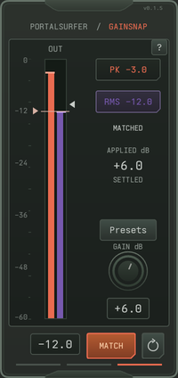

GainSnap matches a track's Peak or RMS level to a target, then lets you hold the
resulting gain. It applies smooth, linear gain without clipping or limiting
signals at 0 dBFS. The macOS release is a VST3 for Apple Silicon Macs.
GainSnap is free with optional donations and needs no account or license activation.

# Install and update

1. Quit your DAW before installing or replacing the plug-in.
2. Copy `GainSnap.vst3` from the release ZIP into
   `~/Library/Audio/Plug-Ins/VST3/`. In Finder, choose **Go > Go to Folder** and
   paste that path. Create the folder if it does not exist.
3. Remove duplicate older GainSnap bundles from other VST3 folders.
4. Open your DAW, rescan VST3 plug-ins if needed, and load GainSnap on an audio track.

The release bundle is signed and notarized for macOS. It contains the Apple
Silicon build only; this release does not include Intel Mac or Windows binaries.
Keep your Live Set saved before replacing a plug-in. Updating retains the saved
mode, target and gain; it does not start a new Match pass automatically.

# Match a track

1. Choose **Peak** or **RMS** using the output readouts.
2. Set a target using the left meter triangle or the number below the meter.
   You can also choose a preset.
3. Turn on **Match** and play the loudest relevant section of the track.
4. Wait for the correction to settle, then turn Match off to hold that gain.

Match listens for 300 ms after the first usable signal, then blends smoothly
into the correction. RMS waits for a complete measurement window. Leave Match
on while stronger passages play: newly stronger evidence can reduce the gain.
Quiet passages and silence do not erase the session measurement or raise the
correction. **Restart** begins a fresh measurement. Changing the target reuses
retained evidence; switching Peak/RMS starts a new measurement.

{width=200px}

# Peak and RMS

**Peak** uses the highest stereo sample peak encountered during the Match
session. It links both channels to one gain, preserving their balance. Use it
for transient material or to normalize a sample's peak.

**RMS** uses the strongest complete 300 ms sliding mean-square window of the
louder channel. The live RMS meter shows the latest window, so it can fall
between hits even though the correction remains settled. A full-scale square
wave reads 0 dBFS RMS; a full-scale sine reads about −3.01 dBFS RMS.
These are dBFS measurements, not LUFS loudness targets.

Peak correction ranges from −36 to +120 dB. RMS correction retains a +24 dB
boost cap. Signals at or below −120 dBFS are treated as silence. Gain range
limits can prevent matching the selected target exactly.

# Techno presets

These starting points assume a Utility adding +12 dB on the main bus. Peak
presets target −12 dBFS or lower before that boost. Presets follow the selected
Peak/RMS mode and preserve whether Match is on or off.

| Preset | Peak target | RMS target |
| --- | ---: | ---: |
| Kick | −12 dBFS | −24 dBFS |
| Sub | −14 dBFS | −18 dBFS |
| Tom / Mid-bass | −16 dBFS | −22 dBFS |
| Percs | −18 dBFS | −26 dBFS |
| Textures / Synths | −20 dBFS | −24 dBFS |
| Effects | −22 dBFS | −28 dBFS |
| Normalize | −12 dBFS | −24 dBFS |

RMS presets sit lower to leave room for transients. They match average level
and do not impose a peak ceiling. Choose Peak when you want to match the
highest observed sample. These are individual-track starting points; summing
tracks can produce a higher main-bus level.

# Controls and feedback

The orange bar shows output Peak; the purple bar shows output RMS. Each lane
has a floating stripe that holds its highest level for two seconds, then falls
at 1.5 dB per second without dropping below the live bar.

The **left triangle** sets the target in dBFS. The **right triangle** sets gain
in dB on its own scale. Its −36 dB minimum sits at the meter bottom, and unity
gain sits beside the meter's −12 dB mark. Its position does not represent the
output level. The knob adjusts the same gain. Editing either gain control
turns Match off.

**Applied dB** reports the actual gain after smoothing. Increasing, Decreasing
and Settling indicate adjustment; Settled means the correction has stopped
moving. Orange Match pulses softly while listening or adjusting. **Below
Target** and the shortfall in dB mean the gain range prevents reaching the RMS
target. The shortfall uses the retained measurement, not a quieter current beat.

# Editing and shortcuts

- Drag either triangle or the knob. Drags continue beyond the editor until you
  release the mouse button.
- Drag a numeric field up or down, or click it and type a value. Press Enter to
  confirm numeric entry. Hold Shift for finer numeric-field dragging.
- Focus a control and use arrow keys for steps; Shift gives smaller keyboard steps.
  Shift while dragging a triangle or knob snaps to whole dB steps.
- Double-click a gain control to reset to 0 dB and stop Match. Double-click a
  target control to reset to −12 dBFS.
- Space passes through to the DAW transport. Enter activates a focused button.
- Open **?** for compact help. Escape closes Help or Presets.

# Floating-point headroom

GainSnap does not hard-clip at 0 dBFS, enforce a Peak target as an instantaneous
ceiling, or limit RMS transients. Newly louder samples pass through the smooth
gain while Match adapts. Manual and held gain can also produce output above
0 dBFS. Only non-finite samples and numeric overflow at the floating-point
range boundary are contained.

Your DAW and later effects receive the louder signal. Downstream processors
may distort or clip, and final hardware or fixed-point export needs appropriate
output headroom. Reduce gain later in the chain when necessary.

# Troubleshooting

**The plug-in is missing:** confirm the VST3 folder, remove duplicate copies,
restart your DAW and rescan. Use the Apple Silicon build on an Apple Silicon Mac.

**Match keeps listening:** play usable audio long enough to fill the measurement
window. Silence does not provide a new correction.

**The meter falls below the target between hits:** this is expected. GainSnap
retains the strongest evidence rather than raising gain in quieter gaps.

**The sound still distorts above 0 dBFS:** inspect later effects and the final
output. GainSnap passes over-full-scale audio rather than limiting it.

Download updates from the [GainSnap product page](https://portalsurfer.gumroad.com/l/gainsnap).
See the included changelog for changes in this release.
